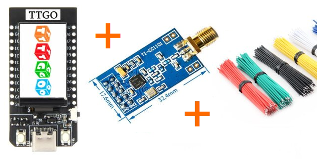
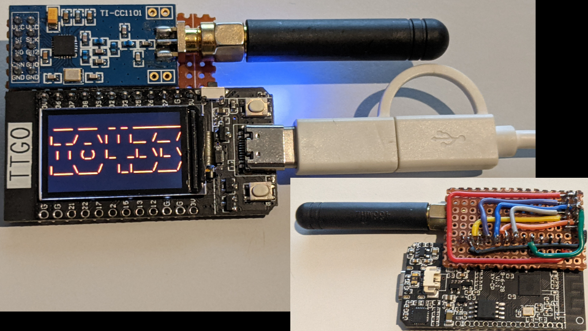
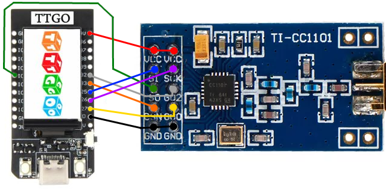
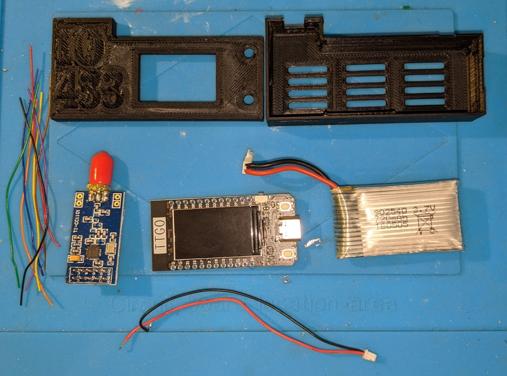
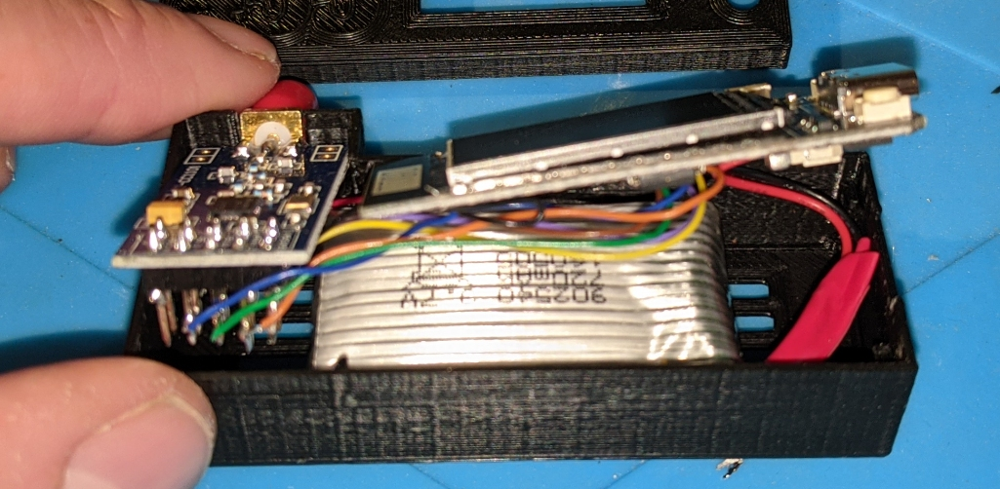
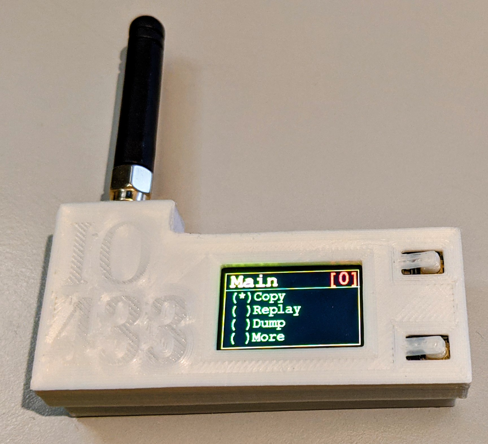

# Project IO433

```
 ___ ___  _ _ ________
|_ _/ _ \| | |__ /__ /
 | | (_) |_  _|_ \|_ \
|___\___/  |_|___/___/
                       
```
## Description

IO433 is an open-source ESP32 (TTGO T-Display) & CC1101 based 433Mhz sniffer.
It can sniff, store, replay, dump and monitor most 433Mhz (currently ASK-OOK only) signals.
These include garage door openers, remote doorbells, sensors and similar devices.

The core of this project aims to be its simplicity, reliability and versatility.
With a couple of ICs and a by 'connecting some wires', one can start messing around with 433Mhz devices and decode their communications protocols.
It's mainly a proof-of-concept but already encompasses several very useful features.

```bash
│  # The current dir is a platformIO project and can be imported straight from here.
├── arduino  # an example arduino project that implements a remote for some ASK-OOK-PWM signals based on a FS1000A
├── docs     # docs and pictures
├── libsigrokdecode   # a modified PWM decoder that shows bits and nibbles (sigrok/PulseView)
└── [others] # platformio project files and libraries
```

## Bill of Materials

| Qty. | Description | Obs. |
|------|------------------------|-----------------------------------------------------------------|
| 1 | ESP32 TTGO T-Display | ESP32 controller with a 1.14" LCD and two buttons for navigation |
| 1 | TI-CC1101 | A CC1101 based module for 433Mhz (and other frequencies) communications |
| 8 | Wires | Some wires :) |



* All the components can be easily found in the usual online stores such as *AliExpress* ([ESP32](https://aliexpress.com/item/1005002283398938.html) - [CC1101](https://aliexpress.com/item/4001256083868.html)), *Amazon*, *eBay*, etc.


## IO433 Wiring

### Prototype photo and assembly suggestion



This is just a suggestion on how to wire the ESP32 and the CC1101. A perforated PCB can be used to make the prototype more sturdy.

### IO433 Wiring



Details of the wiring between the ESP32 and CC1101. The pinout choosing is important. If changed, not only the code should change to reflect the new pinout, as one must make sure the corresponding ports on the ESP32 support the I/O operation mode that the code needs. 

### Assembly with battery and 3D printed case

If you want, you can use the 3D printed case that supports a 902540 720mAh or even a 903048 1800mAh, 3.7V battery (should last for a day or two)
The full material is listed bellow:







### 3D case

Tinker/download it from [tinkercad] (https://www.tinkercad.com/things/bPiFpUXC7pQ)
or grab the STL from the [docs] (docs/IO433.stl)

## How to flash IO433   

### Using [Platformio](https://platformio.org/)

* Clone this repository 
* Open in PlatformIO
* Connect USB-C cable to TTGO
* Build and upload

## How to use it

Plug the ESP32 to a battery or a to a USB-C cable. The current menu structure is the following:

```bash
│ Main
├── Copy   # Copy signal to current memory bank
├── Replay # Replay signal from current memory bank
├── Dump   # Dump current memory bank to screen and serial (fixed 100kbps, for easy analysis on third party software [ex. PulseView])
└── More
    ├── Monitor # Dump raw signal to screen and RSSI info
    ├── Raw Out # Dump current signal to serial as fast as possible (default 1Mbps serial)
    └── About   # About menu
```

## Button behaviour

* UP and DOWN short press, moves between menu items
* UP long press is moves back a level
* DOWN long press enters current submenu or function
* UP or DOWN double press moves back and forward from memory banks (to store/replay multiple signals) 

## Dependencies

This project uses:

 * Button2 lib (which should auto-update on build via platformio.ini)
 * SmartRC-CC1101-Driver-Lib (on /lib, added minor changes for the ESP32 TDisplay)
 * TFT_eSPI (on /lib, added minor changes for the ESP32 TDisplay)

# Improvements

There are many possibilities for improvements:

* Code refactoring. Make SimpleMenu a proper lib.
* Better SPIFFS management
* Configuration menus for changing output data rates and formats
* Configuration menus for CC1101 setup: frequencies, modulations, data rates and bandwidth
* Implement other modulations besides ASK-OOK
* Add upload data files from PC to be replayed
* Add accept from serial and transmit features
* and so forth...

Feel free to clone and play around, as well as to contribute and make a pull request.

## Kudos

Shameless README.md 'template' rip from [@jpdias](https://github.com/jpdias)
